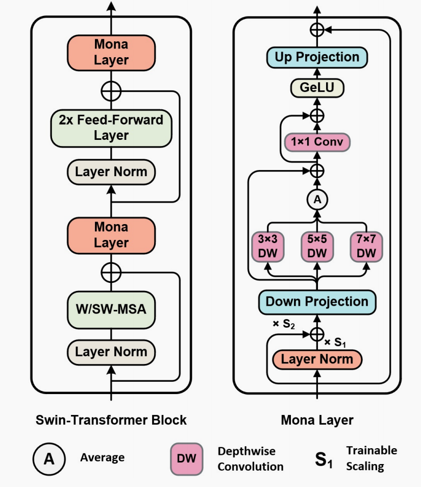
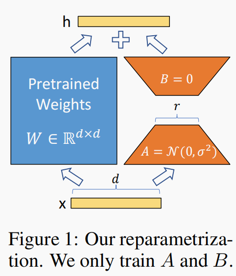

# 2025

## Mona

Breaking Performance Shackles of Full Fine-Tuning on Visual Recognition Tasks

**视觉任务迁移方式**：

1、预训练模型+全面微调  （在训练过程中，参数全部被更新）

2、delta-tuning  （只更新局部参数）

**delta-tuning**可以分为三种类型：

1、固定预训练主干中的大部分参数，进队少量参数进行微调（分类头、检测头......）

2、对预训练模型中的某些参数进行重新参数化 

3、固定预训练主干的原始参数，添加额外可训练结构（prompt series， adapter series）

**Mona的结构**：

Mona通过输入分布调节与多尺度卷积感知机制实现预训练特征的高效重塑与多角度认知增强。

1、Input Optimization：在Mona的顶端设计一个Layer-Norm和两个可学习的参数s1，s2来调整输入层分布和固定层输入的比例，提升微调稳定性。

2、Multi-Cognitive Visual Filters：先对特征下采样，使用多尺度的DWConv增强认知维度，再上采样和输入特征融合。

# 2024

## ProVP

用于视觉-语言大模型，以CLIP为预训练。

解决了VPT的 VPT-DEEP每层的提示符是独立学习没有互动从而导致训练不稳定的问题。

1、和VPT相同，在每层transform都加一个提示符，但是前一层提示符经过transform的输出作为后一层提示符的输入。

2、对比特征重构：小批量图像中，约束同意图像的提示特征与预训练特征相近，不同图像的特征远离。

# 2022

## VPT 

Visual Prompt Tuning

在Transformer的输入层插入一个提示符，一个提示符就是一个d维可学习的向量，VPT一共探讨了两种插入方式：

1、VPT-SHALLOW :  只在第一个Transformer的输入层插入提示符

2、VPT-DEEP :  在每层Transformer的输入层都添加一个提示符

第二种方式会好一些，但是每一层插入的提示符是相互独立的，没有信息互动，会有训练不足、不稳定的风险。

## LORA

LORA: LOW-RANK ADAPTATION OF LARGE LANGUAGE MODELS

应用领域：自然语言处理

1、在冻住预训练参数的基础上，引入小型LoRA模块，具体来说也就是引入额外的可训练参数，在训练模型的过程中，只更新这些引入的额外模块，从而减少内存占用以及增快训练速度。

2、LoRA是由两个低秩的矩阵相乘得到的一个矩阵，大大减少了参数量，计算公式如下：
$$
W= BA
$$

$$
W ∈ R^{d×k},
B ∈ R^{d×r},
A ∈ R^{r×k},
$$

3、LoRA是与预训练模型并行的添加一个可训练矩阵，输入、输出维度与原预训练模型相同，在推理部署的时候可以与预训练参数进行合并，不会增加推理速度，正向传递计算公式为：
$$
h = W_0x + ∆W x = W_0x + BAx
$$

