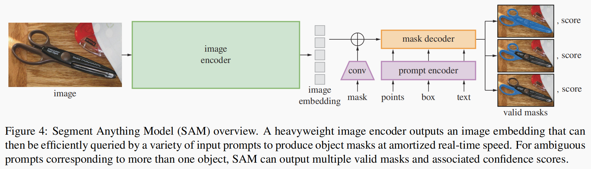

# 图文对比学习预训练-CLIP

### 1、动机：

​		主流的视觉模型几乎都以来人工标注数据集，这样有三大局限：类别封闭、标注成本高、泛化能力弱。

### 2、方法：

（1）整体结构：

CLIP由两个编码器组成：**图像编码器**和**文本编码器**

图像编码器（Image Encoder）：resnet  或者 vision transform

文本编码器（Text Encoder）：CBOW 或者 Transform


（2）训练方式：对比训练

​		模型学习图像和文本的匹配关系，图像通过图像编码器提取图像特征，文本是固定的prompt结构（A photo of {类别}），通过文本编码器提取文本特征，计算图像特征与文本特征的相似度，从而确定其图像类别。


# 自监督视觉特征表示学习-DINO

## DINOV1

#### 1、核心思想：

​		通过在大规模的无标签数据集上进行对比学习（引入了一种新的对比学习方法，将原始图像的特征与随机裁剪的图像的特征进行对比，从而学习到更好的视觉通用表征），学习出一组具有可传递性的视觉特征表示。

#### 2、参数更新策略：

​		采用自蒸馏的方法，包含了教师网络和学生网络两部分，教师网络的参数不基于反向更新，而是学生模型梯度回传之后，通过指数移动平均（EMA）直接将学生网络学习到的模型参数更新给教师网络，公式如下：
$$
\theta_{t} <- \lambda \theta_{t} + (1-\lambda)\theta_{s}
$$
$\theta_{t}$是教师网络参数，$\theta_{s}$是学生网络参数，$\lambda$在0.996和1之间变化。

#### 3、数据增强：

​    核心数据采样策略：图像裁剪

- Local views：局部视角（或small crops），抠图面积小于原始图像的50%
- Global views：全局视角（或lager crops），抠图面积大与原始图像的50%

​        学生模型接受所有预处理过的crops图，教师模型只接受来自global views的裁剪图，鼓励从局部到全局的响应，从而训练学生模型从一个小的裁剪画面中推断出更广泛的上下文信息。

​    其他的一些随机增强：

颜色扰动、高斯模糊、曝光增强

#### 4、损失函数：

​        学生网络和教师网络的输出都是一个一维的嵌入，先使用softmax函数分别将两个模型的输出归一化，再计算两个向量的交叉熵损失，使学生的输出不断向教师的输出靠近。
$$
loss = CrossEntropyLoss(softmax(out_{s}), softmax(out_{t}-out_{tMean}))
$$

```
补充概念：模式崩塌（mode collapse）
	mode collapse是指网络的学习过程中出现了多样性减少的现象，具体来说就是网络学习到一组特征表示的时候，会出现多个输入数据映射到相同的特征表示的情况（网络优化过程中陷入了局部最优），只考虑一部分数据的特征表示，忽略了其他数据样本的模式和特征，导致多样性缺失的现象
	
DINO解决方式：
Centering and Sharpening
Centering：将原始的激活值减去一个数值（Logits = Logits - Logits_mean），目的是将所有的激活值有正有负，这样在做softmax的时候，会增大各个激活值之间的差距。
Sharpeninng：在softmax函数里面加入一个temperature的参数，来强制模型将概率分布更加尖锐化，放大细微差距。
```


## DINOV2

#### 1、数据构建与优化

（1）去重：PCA哈希和Faiss库

（2）自监督图像检索：先计算出每个图像的嵌入向量，然后使用聚类算法将这向量分组

#### 2、判别性自监督训练

（1）损失：融合了DINO（图像级对比学习）与iBOT（补丁级重建）的损失函数，同时引入 SwAV 的 Skinkhorn-Knopp 中心化技术

- DINO（图像级对比学习）：内容见上
- iBOT（补丁级重建）：将一个完整patch的输入送入到教师网络中，得到输出 $out_{t}$，将遮挡部分的patch的输入送学生网络，得到 $out_{s}$ ，然后使用softmax和Centering计算损失。目的是为了让学生网络在缺失补丁信息的情况下，通过教师网络提供的监督信息，通过全局上下文推断被遮挡的特征。
- DINO 和 iBOT都使用了一个可学习的MLP头，但是共享参数效果会变差，因此DNIO和iBOT使用两个独立的头。

（2）KoLeo 正则化：通过计算特征向量之间的差异来确保它们在批次内均匀分布。

（3）训练最后一段时间，将图像的分辨率提升到518*518

```
补充知识：
DINOV2的数据构建中，清理数据集用到的一个方法：
A Self-Supervised Descriptor for Image Copy Detection
这个工作中的相关定义：
（1）数据副本：只要是来自同一个2D图像就是该图像的副本，比如说加水印、拉伸、模糊、旋转等等
（2）实例匹配问题：识别同一个三维物体在不同视角/相机变化下的图像
```


# 图像分割-SAM系列

# SAM

SAM任务通过给图像分割任务提供Prompt提示来完成任意目标的快速分割。

#### SAM 模型结构：

SAM模型包含三部分：Image Encoder、Prompt Encoder、Mask Decoder，整体结构如下：



​		整体流程：图像经过 image encoder 编码器得到图像特征，Prpmpt 经过 Prompt Encoder编码，两部分的embedding再经过mask decoder得到融合后的特征。

- Image Encoder：可以是任何网络，SAM使用的是ViT模型提取图像特征
- Prompt Encoder：SAM 模型的 Promt 包括两类：稀疏型（点、框、文本）和密集型（掩码）。掩码经过卷积之后与图像 embedding 按逐元素相加，稀疏型通过编码之后与前面得到的embedding相加。
- Mask Decoder：建立image embedding和prompt embedding之间的映射关系。
- Resolving ambiguity：只有一个输出的时候，对于模糊提示时，对多个有效掩码取平均作为输出，可能会与想要的结果不同，SAM对模型修改，针对单一提示预测多个输出掩码，经过实验三个掩码（整体，局部，子部分）足以应对大多数的情况，每一个掩码都会有一个confidence score。


## MobileSAM

​		MobileSAM主要是针对SAM中的图像编码器优化，SAM中的图像编码器使用的是ViT-H，不管是训练还是推理，模型都很大，MobileSAM用较小的图像编码器来替换SAM中的图像编码器。

```
补充知识：
蒸馏方式：
1、耦合蒸馏：就是在蒸馏过程中，图像编码器和prompt引导的mask解码器的参数都是可训练的
2、半耦合蒸馏：蒸馏过程中，图像编码器的参数是可训练的，prompt引导的mask解码器的参数是直接复制过来的，冻结参数，完全不参与训练。
3、解耦性蒸馏：蒸馏过程中，图像编码器参数是可训练的，prompt引导的mask解码器的参数是直接复制的，但不完全重新训练，而是进行微调。
```


# 状态空间模型-Mamba

适用于语言建模及其他序列建模，可匹敌与Transform。


